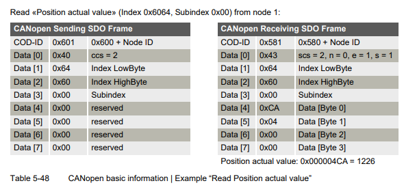
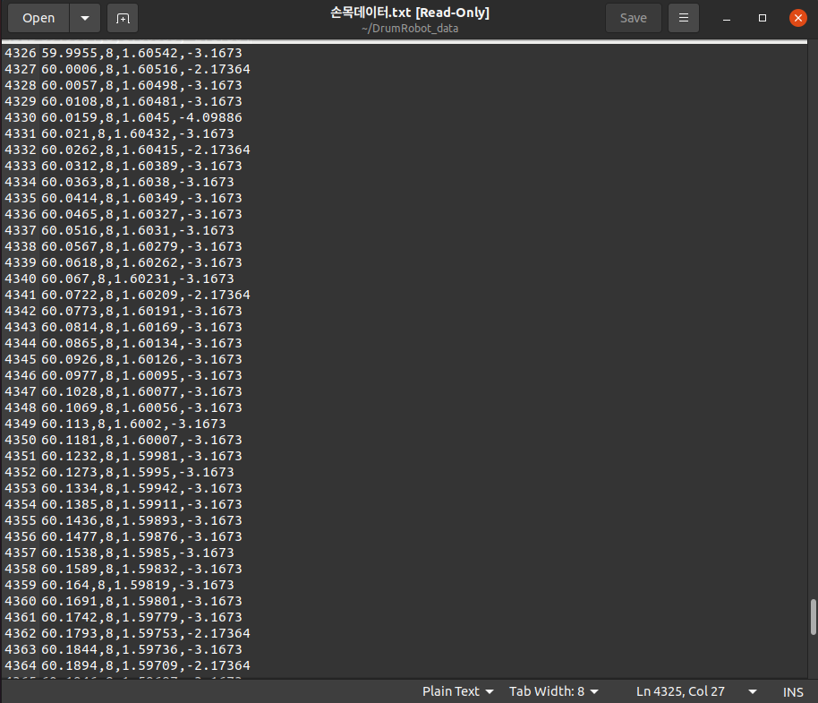
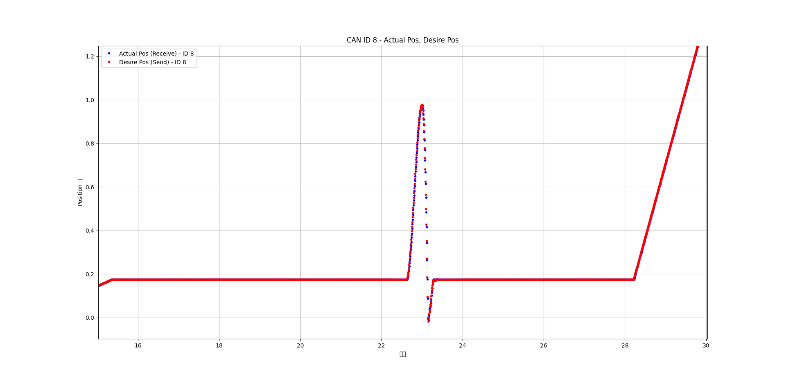
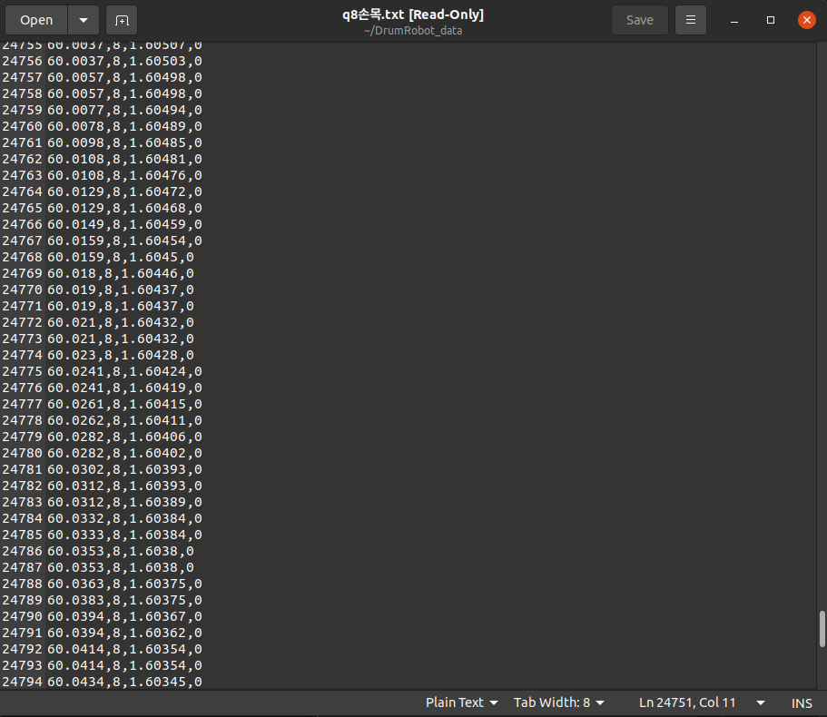
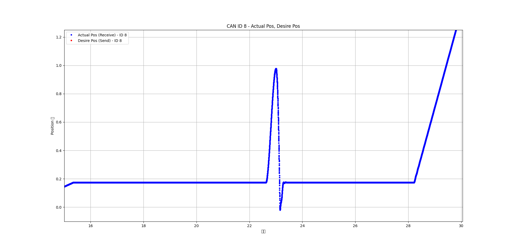
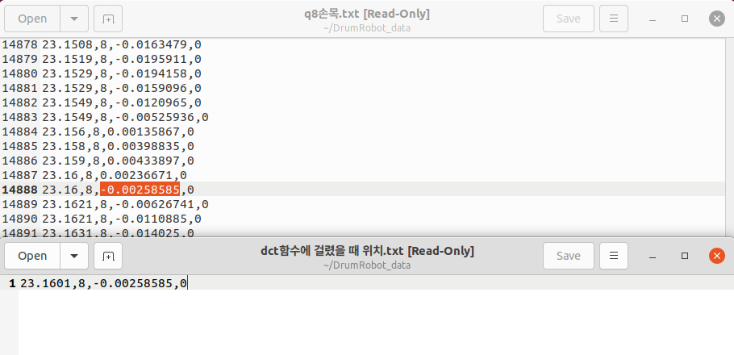
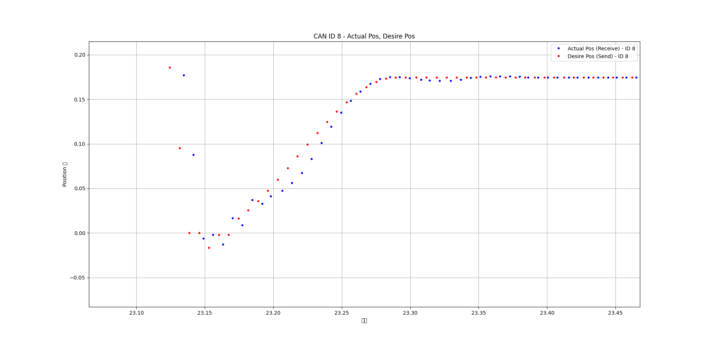

# SDO_currentposition

**포지션 제어로 5ms마다 모든 모터에게 명령을 보내는 상황 속에서, SDO communication으로 모터에게 신호를 보내고 손목 모터(Maxon)의 현재 위치 제일 최신 값 받아오기**

**- 기대점: 모터의 CST모드에서 CSP모드로 변환할 때, 보다 정확한 모터 위치 값을 받아올 수 있음**

---

**ㄴ Maxon모터 EPOS4 Application Notes SDO communication**

---
# send

<pre>
maxoncmd.getActualPos(*maxonMotor, &frame); //Maxon모터에게 1ms마다 신호
canManager.txFrame(motor, frame); // CAN을 통해 보내줌
</pre>

<pre>
fun.appendToCSV_DATA("손목데이터", (float)maxonMotor->nodeId, maxonMotor->motorPosition, maxonMotor->motorTorque);
</pre>

**ㄴ 5ms (0.005) 단위로 데이터가 모터로 보내짐. (궤적 포지션 제어 명령)**

**ㄴ 아래 그래프에서, 빨강 그래프가 포지션 제어로 보내는 제어 명령**

---
# receive

<pre>
// Maxon모터에서 1ms마다 SDO 응답 확인
if (frame.can_id == (0x580 + maxonMotor->nodeId)) {
    if (frame.data[1] == 0x64 && frame.data[2] == 0x60 && frame.data[3] == 0x00) { 
        int32_t pos_enc = frame.data[4] | (frame.data[5] << 8) | (frame.data[6] << 16) | (frame.data[7] << 24);

        float pos_degrees = (static_cast<float>(pos_enc) * 360.0f) / (35.0f * 4096.0f);
        float pos_radians = pos_degrees * (M_PI / 180.0f);  
        maxonMotor->motorPosition = pos_radians;

        fun.appendToCSV_DATA("q8손목", (float)maxonMotor->nodeId, maxonMotor->motorPosition, 0);
        current_Position = maxonMotor->motorPosition; // 현재 위치 값 해당 변수에 덮어쓰기
    }
}
</pre>

<pre>
fun.appendToCSV_DATA("q8손목", (float)maxonMotor->nodeId, maxonMotor->motorPosition, 0);
</pre>

**ㄴ SDO를 사용하여 받아오는 모터 현재 위치 값을 주기적으로 바로 받아 옴**

**ㄴ 파란 그래프는 SDO communication으로 받아오는 모터 현재 위치 값**

---

**ㄴ CSP모드에서 CST모드로 전환되는 시점에 받아오는 현재 모터 위치 값 받아옴**

**ㄴ 타격감지 시 받아오는 현재위치 값이 그래프 상과 일치함**
