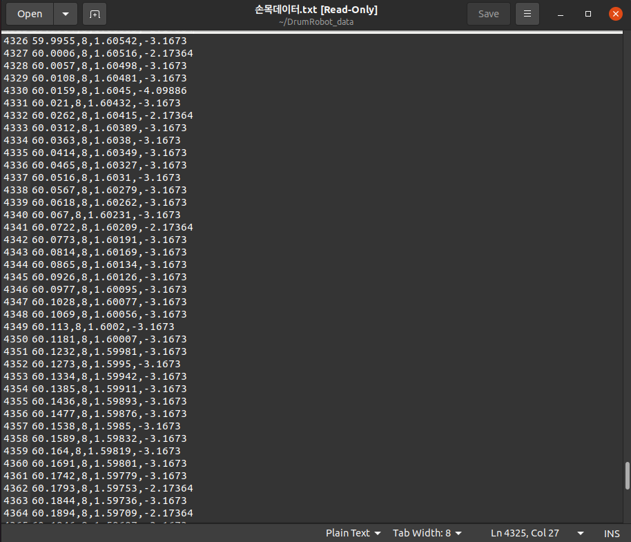
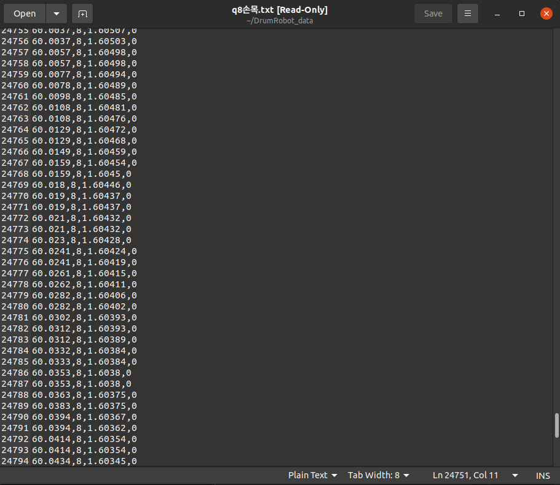

# SDO_currentposition

**포지션 제어로 5ms마다 모든 모터에게 명령을 보내는 상황 속에서, SDO로 모터에게 신호를 보내고 손목 모터(Maxon)의 현재 위치 제일 최신 값을 받아오게 하는 코드**

---

<pre>
fun.appendToCSV_DATA("손목데이터", (float)maxonMotor->nodeId, maxonMotor->motorPosition, maxonMotor->motorTorque);
</pre>

**5ms (0.005) 단위로 데이터가 모터로 보내짐. (궤적 포지션 제어 명령)**

---

<pre>
fun.appendToCSV_DATA("q8손목", (float)maxonMotor->nodeId, maxonMotor->motorPosition, 0);
</pre>

**SDO를 사용하여 받아오는 모터 현재 위치 값을 주기적으로 바로 받아 옴.**

---
